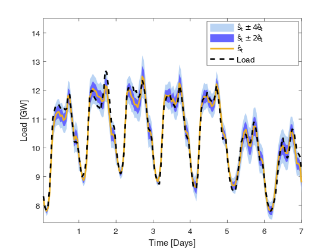
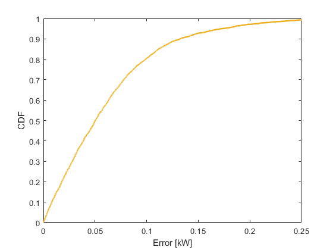

# Example

We forecast load for 400 buildings

The dataset contains load data in 2013.

We execute the following code

```
# Input
load('400buildings.mat')
days_training = 300; 
lambdas = 0.2; # Forgetting factor
lambdar = 0.7; # Forgetting factor
L = 24; # Prediction horizon
C = 48; # Calendar types
R = 3; # Length of feature vector that represents observations
[RMSE, MAPE, load_forecasts, load_demand, estimated_errors] = OPLF(data, days_training, lambdas, lambdar, L, C, R);
```

We obtain that 

```
RMSE = 0.03;
MAPE = 6.27;
```

We plot one week of load demand, load forecasts, and estimated errors



We show the CDF of error


